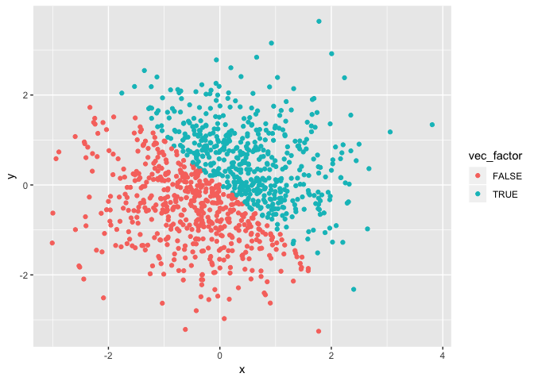

HOMEWORK 1
================
*Apoorva Srinivasan*
9/20/2018

PROBLEM 1 
=========

**This problem focuses on variable types and coercion.**

*The code chunk below creates a data frame of a random sample of size 10 between 0 and 5, a logical vector indicating whether elements of the sample are greater than 2, a character and a factor vector.*

``` r
library(tidyverse)
```

    ## ── Attaching packages ──────────────────────────── tidyverse 1.2.1 ──

    ## ✔ ggplot2 3.0.0     ✔ purrr   0.2.5
    ## ✔ tibble  1.4.2     ✔ dplyr   0.7.6
    ## ✔ tidyr   0.8.1     ✔ stringr 1.3.1
    ## ✔ readr   1.1.1     ✔ forcats 0.3.0

    ## ── Conflicts ─────────────────────────────── tidyverse_conflicts() ──
    ## ✖ dplyr::filter() masks stats::filter()
    ## ✖ dplyr::lag()    masks stats::lag()

``` r
set.seed(1)
problem1_df = tibble(
rsamp = runif(10, 0, 5),
vec_log = rsamp > 2,
vec_char = c("I", "hope", "I", "did", "okay", "for", "my", "first", "P8105", "homework"),

vec_fac = factor(c("heads", "tails", "heads", "heads", "tails", "heads", "tails", "tails", "heads", "tails"))


)
```

*Now, we're taking the mean of each variable in the data frame.*

``` r
mean(problem1_df$rsamp)
```

    ## [1] 2.757569

``` r
mean(problem1_df$vec_log)
```

    ## [1] 0.6

``` r
mean(problem1_df$vec_char)
```

    ## [1] NA

``` r
mean(problem1_df$vec_fac)
```

    ## [1] NA

We observe that the random sample and logical vector return a mean of ~2.76 and ~0.6 respectively. However, we do not get any results for the factor and character variables. This is due to a numeric value attached to the first two vectors so mathematical operations on it is made possible. In the case of character and factor variable types, since they contain strings and do not posses a numerical value hence the mean cannot be found.

*Onto converting variable types*

``` r
as.numeric(problem1_df$vec_log)
```

    ##  [1] 0 0 1 1 0 1 1 1 1 0

``` r
as.numeric(problem1_df$vec_char)
```

    ##  [1] NA NA NA NA NA NA NA NA NA NA

``` r
as.numeric(problem1_df$vec_fac)
```

    ##  [1] 1 2 1 1 2 1 2 2 1 2

-   On converting the logical variable to numeric type, R assigns '0' each FALSE condition i.e. for each value from the random sample less than 2 and a '1' for a TRUE condition i.e. every value which is greater than 2.
-   For the character variable type, the numeric conversion returned nothing since it could not assign a numeric value to random letters
-   In the conversion of factor to numerical type, R assigns the value '1' to heads and '2' to tails.

``` r
as.numeric(as.factor(problem1_df$vec_char))
```

    ##  [1] 6 5 6 1 8 3 7 2 9 4

``` r
as.numeric(as.character(problem1_df$vec_fac))
```

    ##  [1] NA NA NA NA NA NA NA NA NA NA

In the above output we see that the character vector when converted to factor and then that to numeric gives an output of integers. However, the factor vector when converted to character and then numeric gives NA for each entry. When we convert character vector to factor variable, it makes it into some levels. These levels are then assigned numeric values when converted to numeric vector.

PROBLEM 2
=========

**This problem focuses on plotting and the use of inline R code.**

In the code chunk below, we've created a data frame comprised of a random sample 'x' and 'y' of size 1000 from a normal standard distribution and a logical, numeric and factor vector.

``` r
library(tidyverse)
set.seed(1)

problem2_df = tibble(
 x = rnorm(1000),
 y = rnorm(1000),
vec_logical = c(x + y > 0),
vec_numerical = as.numeric(vec_logical),
vec_factor = as.factor(vec_logical)
)
```

-   The size of the dataset is 1000

-   The mean of x is -0.0116481 and the median is -0.0353242
-   The proportion of logical vector is 98

Making a scatter plot using the logical variable.

``` r
ggplot(problem2_df, aes(x = x, y = y, color = vec_logical)) + geom_point()
```


``` r
ggsave("logical_scatter_plot.pdf")
```

    ## Saving 7 x 5 in image

From the plot, we can see that a red color is assigned for every value which is FALSE i.e for every value in the random variable where x + y is less than 0 and a blue color is assigned for every TRUE case i.e every value in the logical vector where x + y is greater than 0. We note that the graph is evenly scattered on the both sides of the slope -1 with maximum concentration around (0,0)

Making a scatter plot using the numerical variables.

``` r
ggplot(problem2_df, aes(x = x, y = y, color = vec_numerical)) + geom_point()
```


In this plot with numeric variables, we observe a gradient being assigned to different range of values with the darkest shade of blue assigned to values close to 0 and the lightest shade for the values near 1. Again, the points are evenly distributed across the slope -1 with the maximum concentration around (0,0)

Now, making the scatter plot using the factor variable

``` r
ggplot(problem2_df, aes(x = x, y = y, color = vec_factor)) + geom_point()
```



The plot using factor variables returns the same plot as the previous one usuing logical variables with red assigned for every FALSE case and blue for every BLUE case. This is because the factor vector was created by coercing the above logical vector.
